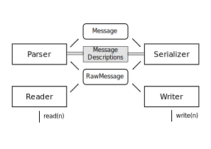

Python-UBX
==========

A python library implementing the binary u-blox UBX protocol.

.. toctree::
   :maxdepth: 2
   :caption: Contents:

Indices and tables
==================

* :ref:`genindex`
* :ref:`modindex`
* :ref:`search`
